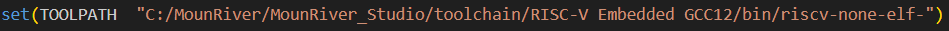
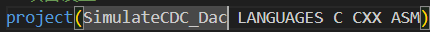
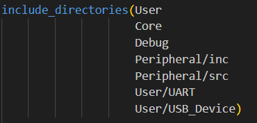
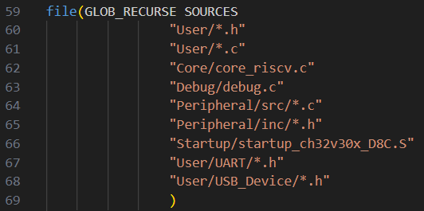

# Настройка vs code под проекты с WCH

1. Установите CMake ( https://cmake.org/download/ ). Gри установке надо будет выбрать опцию Add CMake to the sysstem PATH for all users.

2. Установите Ninja  ( https://github.com/ninja-build/ninja/releases ). После добавьте в System Path путь к месты где расположен файл ninja.exe.

   

   

   Здесь надо выбрать Дополнительно -> Переменные среды -> PATH и там добавить нужный путь.
3. Установите MounRiver Studio (от него понадобится папка toolchain)
4. https://github.com/dreamcmi/WCH-CMake скачайте нужную версию проекта и скопируйте оттуда в свой проект файлы: build.bat, build.sh, CMakeList.txt
5. В файле CMakeLists.txt в строчке

   

   Замените путь в кавычках на путь к соответствующей директории на вашем компьютере.

   ##### ВАЖНО в конце должно стоять начало названий файлов, которая система будет использовать (в данном случае riscv-none-elf-)
6. В строчке с именем проекта замените SimulateCDC_Dac на соответствующееназвание.

   
7. В функции include_directories и file добавьте все директории, в которых лежат используемые файлы.

   

   
8. В папке .vscode (если ее нет, то создайте ее в директории проекта) создайте файл settings.json и пропишите туда:

{

    "cmake.configureOnOpen": false

}

9. В папке .vscode (если ее нет, то создайте ее в директории проекта) создайте файл tasks.json и пропишите туда (в функции flash укажите соответствующие вашей системе пути):

{

    "version": "2.0.0",

    "tasks": [

    {

    "type": "shell",

    "label": "CMake: configure",

    "command": "cmake -GNinja -DCMAKE_EXPORT_COMPILE_COMMANDS=1 -B build",

    "problemMatcher": [],

    "detail": "CMake template configure task"

    },

    {

    "type":  "shell",

    "label": "CMake: build",

    "command": "cmake --build build",

    "group": "build",

    "problemMatcher": [],

    "detail": "CMake template build task"

    },

    {

    "type":  "shell",

    "label": "CMake: clean",

    "command": "Remove-Item build -recurse",

    "problemMatcher": [],

    "detail": "CMake template clean task"

    },

    {

    "label": "flash",

    "type": "shell",

    "command": "openocd -f\"C:/MounRiver/MounRiver_Studio/toolchain/OpenOCD/bin/wch-riscv.cfg\" -c init -c halt  -c 'program ./build/${workspaceFolderBasename}.hex verify'  -c reset -c wlink_reset_resume -c exit  ",

    "problemMatcher": [],

    }

    ]

}

10. Чтобы сконфигурировать, собрать и запустить проект вызовите командную палитру (для Windows - CRTL + SHIFT + P), наберите Tasks: Run Tasks, далее там выберите соответсвующие команды.
