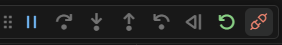

# Настройка vs code под проекты с WCH

1. Установите CMake ( https://cmake.org/download/ ). Gри установке надо будет выбрать опцию Add CMake to the sysstem PATH for all users.


2. Установите Ninja  ( https://github.com/ninja-build/ninja/releases ). После добавьте в System Path путь к месты где расположен файл ninja.exe.
3. 

   

   Здесь надо выбрать Дополнительно -> Переменные среды -> PATH и там добавить нужный путь.
4. Установите MounRiver Studio (от него понадобится папка toolchain)
5. https://github.com/dreamcmi/WCH-CMake скачайте нужную версию проекта и скопируйте оттуда в свой проект файлы: build.bat, build.sh, CMakeList.txt
6. В файле CMakeLists.txt в строчке

   ```
   set(TOOLPATH  "C:/MounRiver/MounRiver_Studio/toolchain/RISC-V Embedded GCC12/bin/riscv-none-elf-")
   ```
   Замените путь в кавычках на путь к соответствующей директории на вашем компьютере.

   ##### ВАЖНО в конце должно стоять начало названий файлов, которая система будет использовать (в данном случае riscv-none-elf-)
7. В строчке с именем проекта замените SimulateCDC_Dac на соответствующее название.

   ```
   project(SimulateCDC_Dac LANGUAGES C CXX ASM)
   ```
8. В функции include_directories и file добавьте все директории, в которых лежат используемые файлы.

   ```
   include_directories(User
                       Core
                       Debug 
                       Peripheral/inc
                       Peripheral/src
                       User/UART
                       User/USB_Device)
   ```
   ```
   file(GLOB_RECURSE SOURCES 
                   "User/*.h"
                   "User/*.c"
                   "Core/core_riscv.c" 
                   "Debug/debug.c"
                   "Peripheral/src/*.c" 
                   "Startup/startup_ch32v30x_D8C.S"
                   "User/UART/*.h"
                   "User/USB_Device/*.h"
                   )
   ```
9. В папке .vscode (если ее нет, то создайте ее в директории проекта) создайте файл settings.json и пропишите туда:

   ```json
   {
   "cmake.configureOnOpen": false
   }
   ```
10. В папке .vscode (если ее нет, то создайте ее в директории проекта) создайте файл tasks.json и пропишите туда (в функции flash укажите соответствующие вашей системе пути) (см. соотвествующие файлы в репозитории):

    ```json
    {

        "version": "2.0.0",

        "tasks": [

        {

        "type": "shell",

        "label": "CMake: configure",

        "command": "cmake -GNinja -DCMAKE_EXPORT_COMPILE_COMMANDS=1 -B build",

        "problemMatcher": [],

        "detail": "CMake template configure task"

        },

        {

        "type":  "shell",

        "label": "CMake: build",

        "command": "cmake --build build",

        "group": "build",

        "problemMatcher": [],

        "detail": "CMake template build task"

        },

        {

        "type":  "shell",

        "label": "CMake: clean",

        "command": "Remove-Item build -recurse",

        "problemMatcher": [],

        "detail": "CMake template clean task"

        },

        {

        "label": "flash",

        "type": "shell",

        "command": "openocd -f\"C:/MounRiver/MounRiver_Studio/toolchain/OpenOCD/bin/wch-riscv.cfg\" -c init -c halt  -c 'program ./build/${workspaceFolderBasename}.hex verify'  -c reset -c wlink_reset_resume -c exit  ",

        "problemMatcher": [],

        }

        ]

    }
    ```
11. Чтобы сконфигурировать, собрать и запустить проект вызовите командную палитру (для Windows - CRTL + SHIFT + P), наберите Tasks: Run Tasks, далее там выберите соответсвующие команды (перед configure надо выполнять команду clean).
12. Чтобы добавить дебаггер, в файл добавьте в tasks.json :

    ```json
    		{
    			"label": "openocd",
    			"type": "shell",
    			"command": "openocd -f \"C:/MounRiver/MounRiver_Studio/toolchain/OpenOCD/bin/wch-riscv.cfg\" -f \"gdb-start.cfg\"",
    			"problemMatcher": []
    		}
    ```
    Далее там же создайте файл launch.json и добавьте туда **(Не забудьте исправить все пути, на соответсвующие вашей системе)**:

    ```json
    {
      "version": "0.2.0",
      "svdPath":"C:/MounRiver/MounRiver_Studio/template/wizard/WCH/RISC-V/CH32V307/NoneOS/CH32V307xx.svd",
      "configurations": [
          {
              "type": "cmake",
              "request": "launch",
              "name": "CMake script debugging",
              "cmakeDebugType": "script",
              "scriptPath": "../${workspaceFolder}/User/main.c"
          },
          {
              "type": "cmake",
              "request": "launch",
              "name": "Debug externally launched CMake process",
              "cmakeDebugType": "external",
              "pipeName": "<insert-pipe-name>"
          },
          {
            "type": "gdb",
            "request": "attach",
            "name": "Attach to gdbserver",
            "executable": "${workspaceRoot}/build/SimulateCDC_Dac.elf",
            "target": ":3333",
            "remote": true,
            "cwd": "${workspaceRoot}", 
            "gdbpath": "C:/MounRiver/MounRiver_Studio/toolchain/RISC-V Embedded GCC12/bin/riscv-none-elf-gdb.exe",
            "autorun": [
                ]
          }
      ]
    }
    ```
    Теперь выполните команду flash и после этого запустите команду openocd (это делается так же, как запускались команды configure, build, flash). После того, как в терминале появится сообщение:

    ```
    Info : Listening on port 3333 for gdb connections
    ```
    перейдиет в вкладку Run and Debug (для Windows - CTRL+SHIFT+D), выберите Attach to gdbserver и нажмите play.

    

    В окне терминала должно появиться сообщение:

    ```
    Info : accepting 'gdb' connection on tcp/3333
    ```
    Дебаггер запущен. После окончания работы с ним важно отключить подключение (кнопка Disconnect), так же в терминае появится сообщение:

    

    ```
    Info : dropped 'gdb' connection
    ```
    После надо остановить работу openocd через прерывание подключения в терминале (для Windows  - CTRL + C).
13. Возможно после добавления json файлов надо будет перезайти в vscode (на случай, если что-то не работает). Аналогично, если после установки всех доп приложений что-то не работает, возможным решением будет перезагрузка системы.

    Если gdb не работает или ведёт себя так, как не должно, то стоит сделать перезагрузку платы через отключение питания.
